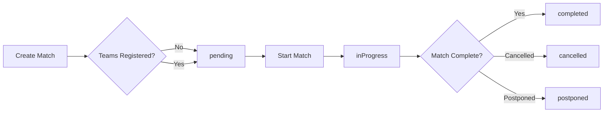

Matches are the core entity in CricPR, representing a cricket game between two teams. Each match contains configuration, team instances, status tracking, and references to innings data.

## Match structure

A match consists of:

- **Two team instances**: References to `TeamInstance` documents for both participating teams
- **Match configuration**: Settings that define the match format, overs, and rules
- **Status tracking**: Current state of the match (pending, in progress, completed, etc.)
- **Match metadata**: Title, location, date/time, and optional URL
- **Toss information**: Winner, decision, and time
- **Results**: Winner team and super over count

### Match statuses

Matches progress through different statuses:

| Status | Description |
|--------|-------------|
| `pending` | Match is scheduled but not started |
| `inProgress` | Match is currently being played |
| `completed` | Match has finished |
| `cancelled` | Match was cancelled |
| `postponed` | Match was postponed to a later date |

## Match types

CricPR supports two match types:

- **Friendly**: Casual matches organized between teams
- **Tournament**: Matches that are part of a tournament structure

## Team instances

Each match uses **team instances** rather than directly referencing teams. This design allows:

- Different player lineups for each match
- Match-specific captain, wicket keeper, and scorer assignments
- Inclusion of guest players for individual matches
- Historical accuracy (teams can change rosters between matches)

<Note>
Team instances are match-specific snapshots of teams with their selected players and role assignments.
</Note>

## Match configuration

Every match requires a `MatchConfig` that defines:

- **Overs**: Number of overs per innings
- **Match type**: Test, ODI, T20, or limited overs
- **Ball type**: Leather, tennis, or other
- **Pitch type**: Rough, cement, turf, astroturf, matting, or other
- **Number of days**: For multi-day matches (1-5)
- **Overs per bowler**: Maximum overs each bowler can bowl
- **Show wagon wheel**: Whether to display wagon wheel visualization

## Team registration

Before a match can start, teams must be registered with:

1. **Player selection**: Regular players from the team roster
2. **Guest players** (optional): Additional players not in the permanent roster
3. **Role assignments**:
   - Captain (required, must be a regular player)
   - Scorer (required, must be a regular player)
   - Wicket keeper (optional)

<Info>
Once teams are registered, the match's `teamsRegistered` field is set to `true`.
</Info>

## Scheduled matches

Matches can be created in advance using the `isScheduled` flag. Scheduled matches:

- Are created with future start times
- May or may not have registered teams yet
- Can be queried separately from active/completed matches
- Allow organizers to plan tournaments in advance

## Match lifecycle

## Toss and innings

Before play begins:

1. **Toss** is conducted to determine which team bats or bowls first
2. The toss winner is recorded with their decision (bat/bowl)
3. **Innings** are created based on the toss decision
4. Each innings tracks one team's batting performance

## Related concepts

- [Teams and players](/concepts/teams-and-players) - Learn about team structure and player management
- [Guest players](/concepts/guest-players) - Understand how to add temporary players to matches
- [Scoring system](/concepts/scoring-system) - Explore how runs, wickets, and stats are tracked
